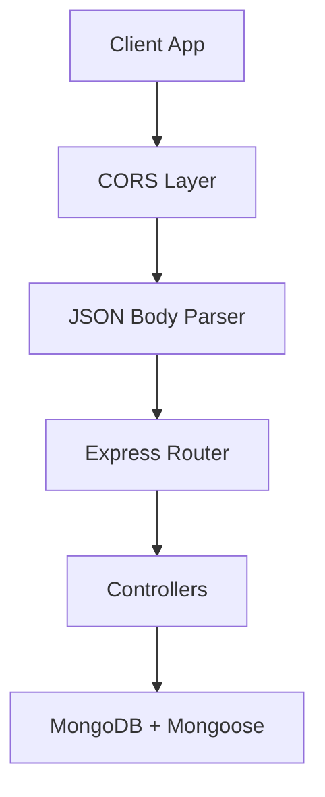
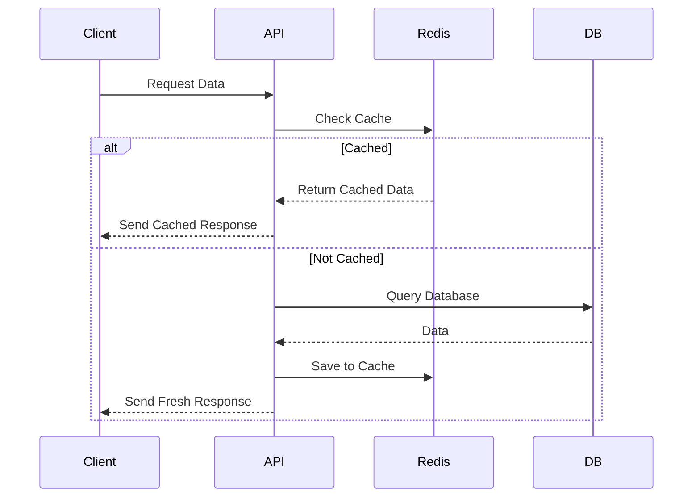
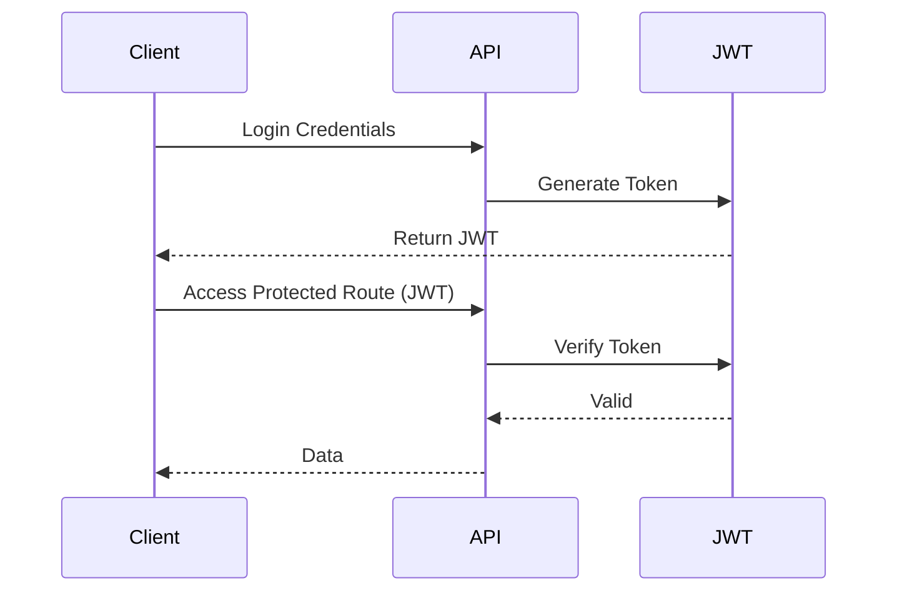
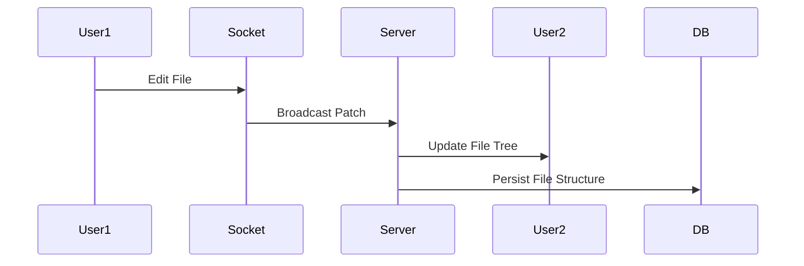

<div align="center">

# 🌌 **Meteorx**

## ⚡ MERN + Realtime + AI-Ready IDE

---

<!-- 🌗 Dark/Light Mode Auto-switch Badges -->

<picture>
  <source media="(prefers-color-scheme: dark)" srcset="https://img.shields.io/badge/Meteorx-Dark_Mode-000?style=for-the-badge">
  
</picture>

</div>

---

# 🧰 **Tech Stack Overview**

<details>
<summary>✨ Click to Expand Tech Icons</summary>
<br>
<div align="center">

| Category      | Tech                                                                                                                                                                          |
| ------------- | ----------------------------------------------------------------------------------------------------------------------------------------------------------------------------- |
| **Backend**   |   |
| **Database**  |         |
| **Auth**      |                                                                                           |
| **Realtime**  |                                                                                   |
| **Cache**     |                                                                                            |
| **AI**        |                                                                            |
| **Utilities** |                                |

</div>
</details>

---

# 🧩 **Backend Architecture Diagram (Express + JSON + CORS)**



---

# 🔥 **Additional System Diagrams**

## 🔴 Redis Caching Flow



## 🟣 JWT Authentication Flow



## 🟦 Project File Syncing (Realtime)



---

# 📂 **Folder Structure (Collapsible)**

<details>
<summary>📁 Click to Expand Folder Tree</summary>
<br>

```
Meteorx/
├── backend/
│   ├── config/
│   ├── controllers/
│   ├── middlewares/
│   ├── models/
│   ├── routes/
│   ├── utils/
│   └── server.js
├── frontend/
└── README.md
```

</details>

---

# 🤖 **AI Features (Google GenAI Examples)**

```js
import { GoogleGenerativeAI } from "@google/generative-ai";
const genAI = new GoogleGenerativeAI(process.env.GOOGLE_GENAI_API_KEY);

const model = genAI.getGenerativeModel({ model: "gemini-pro" });

const response = await model.generateContent("Explain Meteorx architecture.");
console.log(response.text());
```

---

# 🔥 **API Documentation (Professional Format)**

<details>
<summary>📌 Click to Expand User APIs</summary>
<br>

## 👤 User APIs

* **POST /users/register** → Creates a new user
* **POST /users/login** → Authenticates user & issues JWT
* **GET /users/profile** → Returns current user
* **GET /users/logout** → Invalidates current session
* **GET /users/all** → List all users except current user

</details>

<details>
<summary>📌 Click to Expand Project APIs</summary>
<br>

## 🗂️ Project APIs

* **POST /projects/create** → Creates project & assigns user
* **GET /projects/all** → Lists user projects
* **GET /projects/get-project/:projectId** → Full project details
* **PUT /projects/add-user** → Add collaborators
* **PUT /projects/update-file-tree** → Save file code & structure

</details>

---

# 🔐 Environment Variables

> **Note:** Your secret keys and passwords are **not** included here. Replace the placeholder values with your real secrets in a secure `.env` file and never commit them to source control.

```
PORT=8080
MONGO_URI=mongodb://localhost:27017/devin
JWT_SECRET=<YOUR_JWT_SECRET>

# Redis (host/port only; keep the password secret)
REDIS_HOST=<your_redis_host>
REDIS_PORT=<your_redis_port>
REDIS_PASSWORD=<YOUR_REDIS_PASSWORD>

# Google AI (keep key secret)
GOOGLE_AI_KEY=<YOUR_GOOGLE_AI_KEY>
```

---

## 🔁 Full API Routes (HTTP Method, Route, Description)

| Method | Route                              | Description                                                                                                            |
| ------ | ---------------------------------- | ---------------------------------------------------------------------------------------------------------------------- |
| POST   | `/users/register`                  | Creates a new user account.                                                                                            |
| POST   | `/users/login`                     | Authenticates a user and issues a JWT.                                                                                 |
| GET    | `/users/profile`                   | Retrieves the profile details of the currently authenticated user (Protected Route).                                   |
| GET    | `/users/logout`                    | Invalidates the user's current session/token.                                                                          |
| GET    | `/users/all`                       | Retrieves a list of all users in the database, excluding the currently logged-in user (Used for adding collaborators). |
| POST   | `/projects/create`                 | Creates a new project and assigns the current user as a collaborator (Protected Route).                                |
| GET    | `/projects/all`                    | Retrieves a list of all projects the authenticated user is a part of (Protected Route).                                |
| GET    | `/projects/get-project/:projectId` | Retrieves detailed information for a specific project, including file tree and collaborators (Protected Route).        |
| PUT    | `/projects/add-user`               | Adds new collaborators (users) to an existing project (Protected Route).                                               |
| PUT    | `/projects/update-file-tree`       | Updates and persists the project's file structure (code) after a user makes edits (Protected Route).                   |

---

# ⚙️ Installation

```bash
git clone https://github.com/yourname/Meteorx
cd Meteorx/backend
npm install
npm start
```

---
